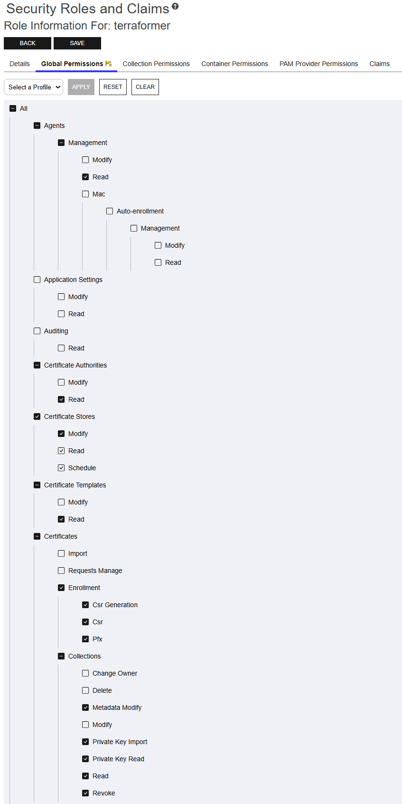
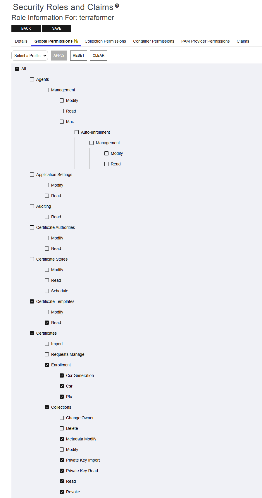
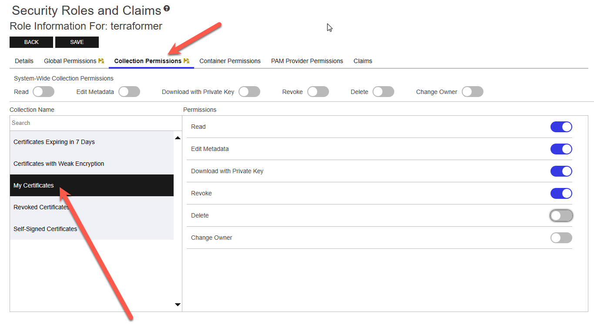
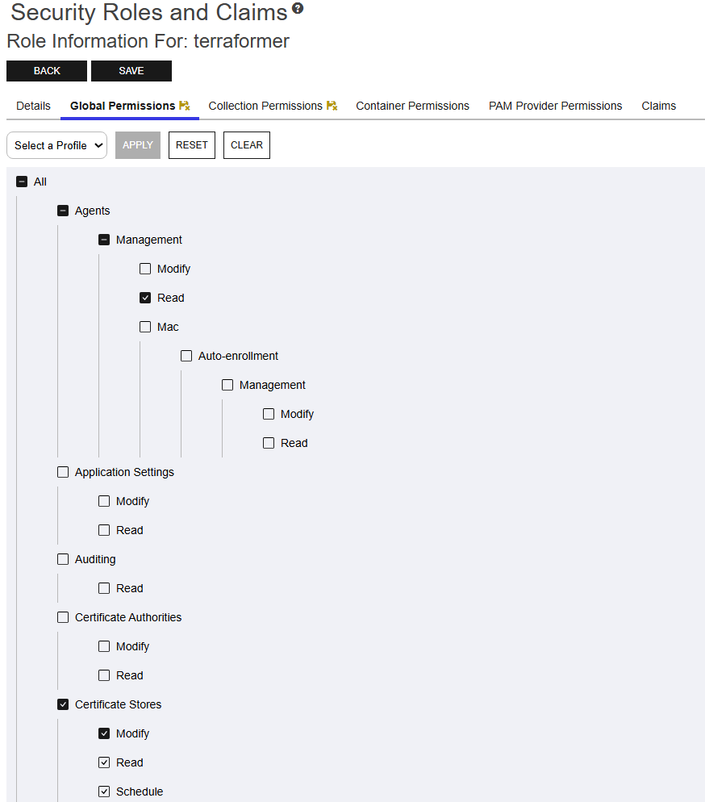
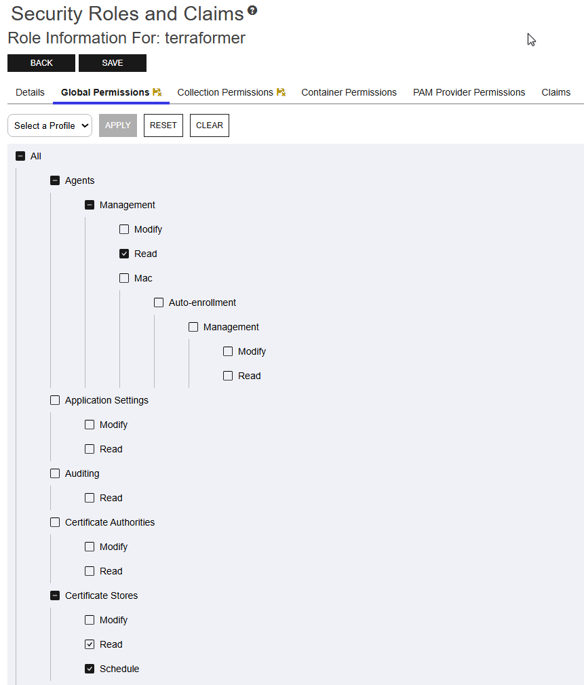
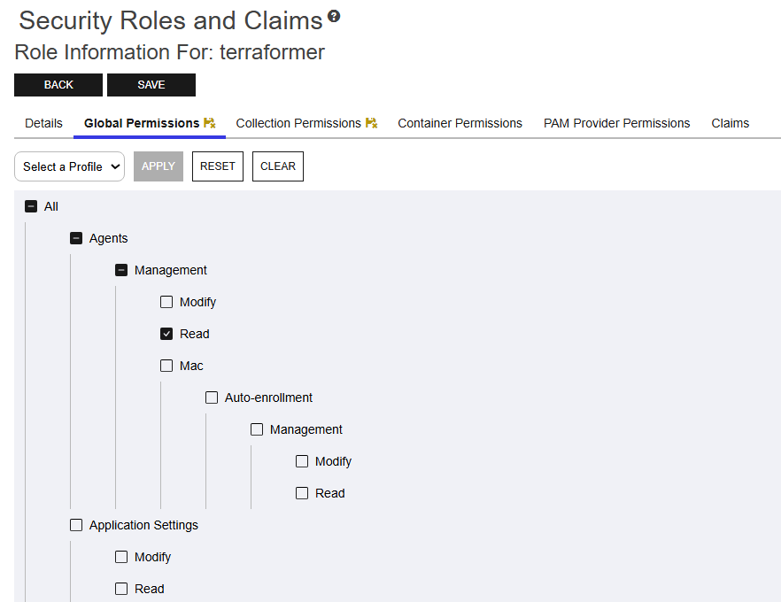
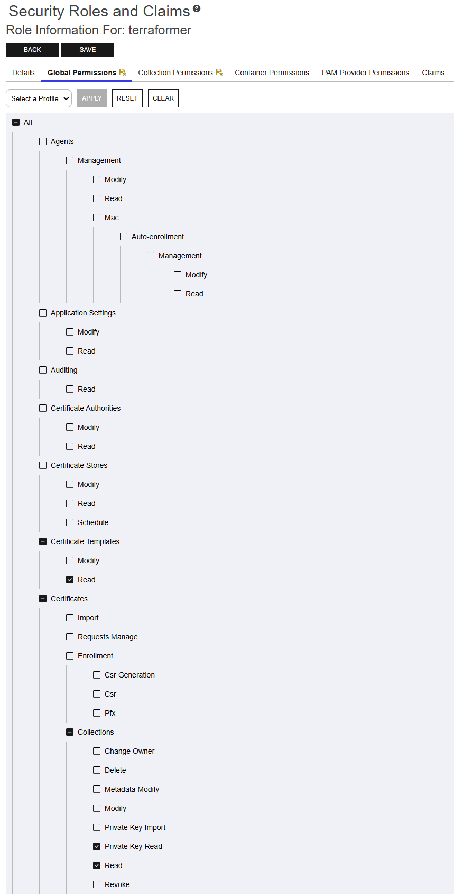
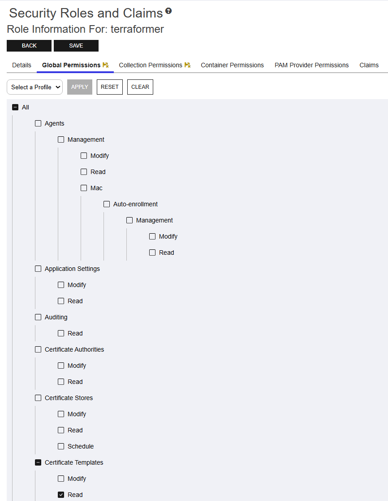
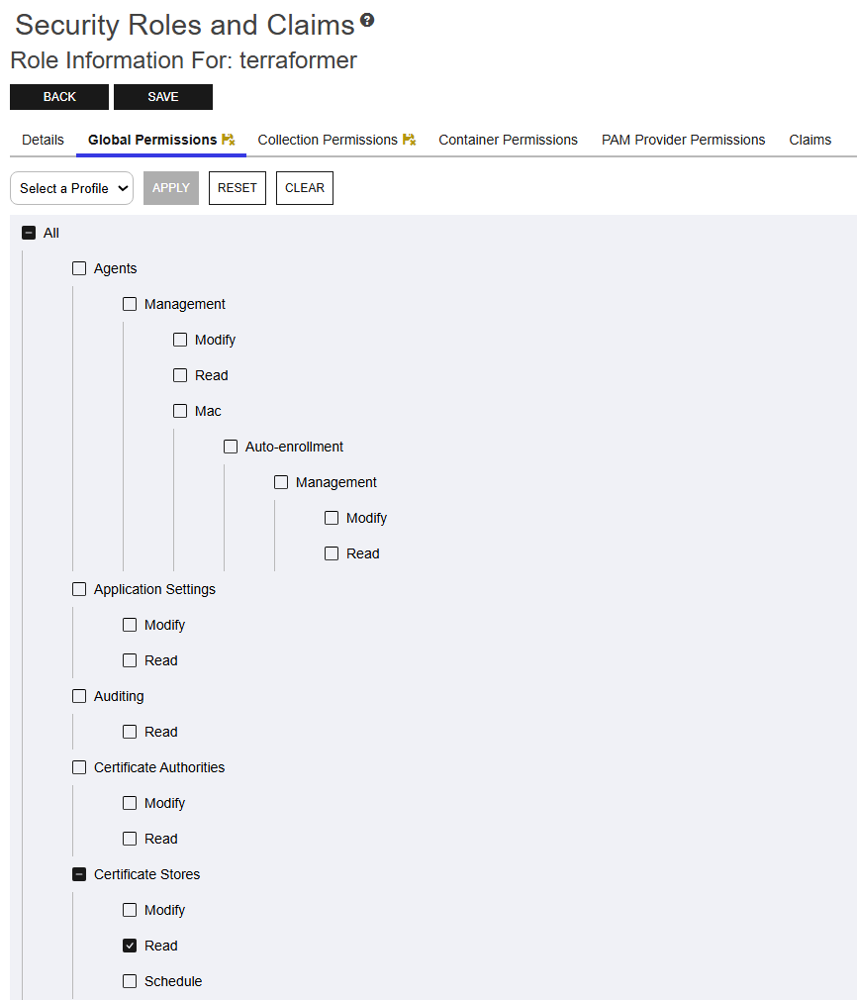

# Keyfactor Terraform Provider

## Integration status: Production - Ready for use in production environments.

## Overview

The Terraform provider for Keyfactor Command enables management of Keyfactor Command resources with HashiCorp Terraform.
Below are currently supported resources:

| Command Resource  | Keyfactor Command Doc                                                                                                              | Terraform Resource                                                                                                                               |
|-------------------|------------------------------------------------------------------------------------------------------------------------------------|--------------------------------------------------------------------------------------------------------------------------------------------------|
| Certificate       | [Certificate](https://software.keyfactor.com/Core-OnPrem/Current/Content/WebAPI/KeyfactorAPI/Certificates.htm)                     | [keyfactor_certificate](https://registry.terraform.io/providers/keyfactor-pub/keyfactor/latest/docs/resources/certificate)                       |
| Certificate Store | [Certificate Store](https://software.keyfactor.com/Core-OnPrem/Current/Content/WebAPI/KeyfactorAPI/CertificateStores.htm)          | [keyfactor_certificate_store](https://registry.terraform.io/providers/keyfactor-pub/keyfactor/latest/docs/resources/certificate_store)           |
| Orchestration Job | [Orchestration Job](https://software.keyfactor.com/Core-OnPrem/Current/Content/WebAPI/KeyfactorAPI/OrchestratorJobsPOSTCustom.htm) | [keyfactor_certificate_deployment](https://registry.terraform.io/providers/keyfactor-pub/keyfactor/latest/docs/resources/certificate_deployment) |

## Support

In the [Keyfactor Community](https://www.keyfactor.com/community/), we welcome contributions. Keyfactor Community
software is open-source and community-supported, meaning that **no SLA** is applicable. Keyfactor will address issues as
resources become available.

* To report a problem or suggest a new feature, go to [Issues](../../issues).
* If you want to contribute bug fixes or proposed enhancements, see the [Contributing Guidelines](CONTRIBUTING.md) and
  create a [Pull request](../../pulls).

## Usage

* [Documentation](https://registry.terraform.io/providers/keyfactor-pub/keyfactor/latest/docs)
* Examples
    * [Certificate Resource](https://registry.terraform.io/providers/keyfactor-pub/keyfactor/latest/docs/resources/certificate)
    * [Certificate Deployment](https://registry.terraform.io/providers/keyfactor-pub/keyfactor/latest/docs/resources/certificate_deployment)
    * [Certificate Store Resource](https://registry.terraform.io/providers/keyfactor-pub/keyfactor/latest/docs/resources/certificate_store)
* [Contributing](https://github.com/Keyfactor/terraform-provider-keyfactor/blob/main/CONTRIBUTING.md)
* [License](https://github.com/Keyfactor/terraform-provider-keyfactor/blob/main/LICENSE)

## Compatibility

| Keyfactor Command Version | Terraform Provider Version |
|---------------------------|----------------------------|
| 12.x                      | 2.2.x                      |
| 11.x                      | 2.2.x                      |
| 10.x                      | 2.0.x                      |
| 9.x                       | 1.0.x                      |

## Requirements

* [Go](https://golang.org/doc/install) 1.23.x (to build the provider plugin)
* [Terraform](https://www.terraform.io/downloads) 1.1.x
* [Keyfactor Command](https://www.keyfactor.com/) (See compatability table)
    * Keyfactor Command account with permissions to required Keyfactor features

## Install

### From terraform registry

For full details on how to use this provider from the public Terraform
registry: https://registry.terraform.io/providers/keyfactor-pub/keyfactor/latest/docs  
Make this file: `providers.tf`

```terraform
terraform {
  required_providers {
    keyfactor = {
      source  = "keyfactor-pub/keyfactor"
      version = ">=2.2.0"
    }
  }
}

provider "keyfactor" {
  # Configuration options
}
```

Then run

```bash
terraform init
```

### From GitHub

- Download the release from the [releases page](https://github.com/Keyfactor/terraform-provider-keyfactor/releases)
- Unzip the release
- Move the binary to a location in your local Terraform plugins directory (typically
  `$HOME/.terraform.d/plugins/keyfactor.com/keyfactor/keyfactor` or
  `%APPDATA%\terraform.d\plugins\keyfactor.com\keyfactor\keyfactor` on Windows)
  for more information refer to
  the [Hashicorp documentation](https://www.terraform.io/docs/cli/config/config-file.html#implied-local-mirror-directories)
- Write a `providers.tf` similar to the example `Provider configuration` below
- Run `terraform init` to initialize the provider

#### Provider configuration

When installing from source the provider configuration will be slightly different from an installation from the public
Terraform
registry. Below is an example of a `providers.tf` for installs directly from a GitHub release:

```terraform
terraform {
  required_version = ">= 1.0"
  required_providers {
    keyfactor = {
      # source = "keyfactor-pub/keyfactor" #Use this source path if installing from the Terraform plugin registry. 
      source = "keyfactor.com/keyfactor/keyfactor" # 
      version = "2.2.0"
    }
  }
}
```

### From Source

#### Provider configuration

When installing from source the provider configuration will be slightly different from an installation from the public
Terraform
registry. Below is an example of a `providers.tf` for build from source installs:

```terraform
terraform {
  required_version = ">= 1.0"
  required_providers {
    keyfactor = {
      # source = "keyfactor-pub/keyfactor" #Use this source path if installing from the Terraform plugin registry. 
      source = "keyfactor.com/keyfactor/keyfactor" # 
      version = "2.2.0"
    }
  }
}
```

### Mac OS/Linux

Example build provider from source in bash:

```bash
git clone https://github.com/Keyfactor/terraform-provider-keyfactor.git
cd terraform-provider-keyfactor
export PROVIDER_VERSION="2.2.0"
export OS_ARCH=$(echo "$(uname -s | tr '[:upper:]' '[:lower:]')_$(uname -m | sed 's/x86_64/amd64/;s/arm64/arm64/')")
export BIN_OUTPUT_PATH="${HOME}/.terraform.d/keyfactor.com/keyfactor/${PROVIDER_VERSION}/${OS_ARCH}"
mkdir -p 
go build -o "${BIN_OUTPUT_PATH}/keyfactor"
chmod oug+x "${BIN_OUTPUT_PATH}/keyfactor"

echo "installed terraform-provider-keyfactor at ${BIN_OUTPUT_PATH}"
```

### Windows

Example build provider from source in powershell:

```powershell
# Clone the repository
git clone https://github.com/Keyfactor/terraform-provider-keyfactor.git
Set-Location terraform-provider-keyfactor

# Set the provider version
$ProviderVersion = "2.2.0"

# Determine the OS and architecture
# Determine the architecture and adjust naming
$Arch = (Get-CimInstance Win32_Processor).Architecture
$OSArch = switch ($Arch)
{
    9 {
        "arm64"
    }      # ARM64
    5 {
        "arm"
    }        # ARM
    6 {
        "ia64"
    }       # Itanium (not typically used in Terraform, but provided for completeness)
    0 {
        "386"
    }        # 32-bit
    1 {
        "amd64"
    }      # x86_64
    default {
        "unknown_arch"
    }
}

# Set the binary output path based on the dynamic OS and architecture
$BinOutputPath = "$env:APPDATA\terraform.d\plugins\keyfactor.com\keyfactor\$ProviderVersion\windows_$OSArch\keyfactor-provider.exe"

# Build the provider
go build -o $BinOutputPath

# Confirm that execution permissions have been applied where needed (not always relevant in Windows)
Write-Host "Provider binary created at $BinOutputPath"
```

## Keyfactor Command Permissions

### Recommended

Below are minimal required Keyfactor Command global permissions to use the full functionality of this Terraform
provider:

- All > Agents > Management > Read
- All > Certificate Authorities > Read
- All > Certificate Stores >
    - Modify
    - Read
    - Schedule
- All > Certificate Templates > Read
- All > Certificates > Enroll >
    - Csr
    - Pfx
- All > Certificates > Collections >
    - Read
    - Revoke
    - Private Key Read
    - Private Key Import



### Resources:

Below are required Keyfactor Command permissions to use each supported Terraform resource type.

#### resource "keyfactor_certificate"

Below are minimal permissions to be able to use a Terraform `resource "keyfactor_certificate"`.

##### Global Permissions

Below are minimal global permissions for a Keyfactor Command account to issue a certificate.

- All > Certificate Templates > Read
- All > Certificates > Enroll >
    - Csr
    - Pfx
- All > Certificates > Collections >
    - Read
    - Revoke
    - Private Key Read
    - Private Key Import



##### Collection Permissions

Below are minimal permissions for a Keyfactor Command account scoped by collection. For more information on collection
permissions please review
the [product docs](https://software.keyfactor.com/Core-Hosted/v12.5/Content/ReferenceGuide/CertificatePermissions.htm?Highlight=collection%20permissions)

###### Global Permissions

- All > Certificate Templates > Read
- All > Certificates > Enroll >
    - Csr
    - Pfx


###### Collection Permissions

- Read
- Edit Metadata
- Revoke
- Download with Private Key



#### resource "keyfactor_certificate_store"

- All > Agents > Management > Read
- All > Certificate Stores >
    - Read
    - Schedule
    - Modify



#### resource "keyfactor_certificate_deployment"

##### Global

- All > Agents > Management > Read
- All > Certificate Stores >
    - Read
    - Schedule



### Data Sources

Below are required Keyfactor Command permissions to use each supported Terraform data source type.

#### data "keyfactor_agent"

- All > Agents > Management > Read



#### data "keyfactor_certificate"

Below are minimal permissions to be able to use a Terraform `data "keyfactor_certificate"`.

##### Global Permissions

Below are minimal global permissions for a Keyfactor Command account to read a certificate.

- All > Certificate Templates > Read
- All > Certificates > Collections >
    - Read
    - Private Key Read



##### Collection Permissions

Below are minimal permissions for a Keyfactor Command account scoped by collection. For more information on collection
permissions please review
the [product docs](https://software.keyfactor.com/Core-Hosted/v12.5/Content/ReferenceGuide/CertificatePermissions.htm?Highlight=collection%20permissions)

###### Global Permissions

- All > Certificate Templates > Read



###### Collection Permissions

- Read
- Download with Private Key


#### data "keyfactor_certificate_store"

- All > Agents > Management > Read
- All > Certificate Stores >
    - Read



#### data "keyfactor_certificate_template"

- All > Certificate Templates > Read


## Contributing

The Keyfactor Terraform Provider is an open source project. To contribute, see
the [contribution guidelines](https://github.com/Keyfactor/terraform-provider-keyfactor/blob/main/CONTRIBUTING.md).

[Issues](https://github.com/Keyfactor/terraform-provider-keyfactor/issues/new/choose) may also be reported.

## License

For license information, see [LICENSE](LICENSE). 